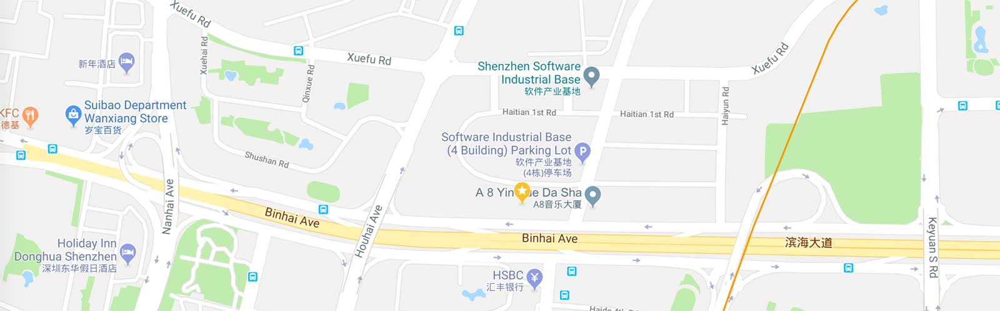
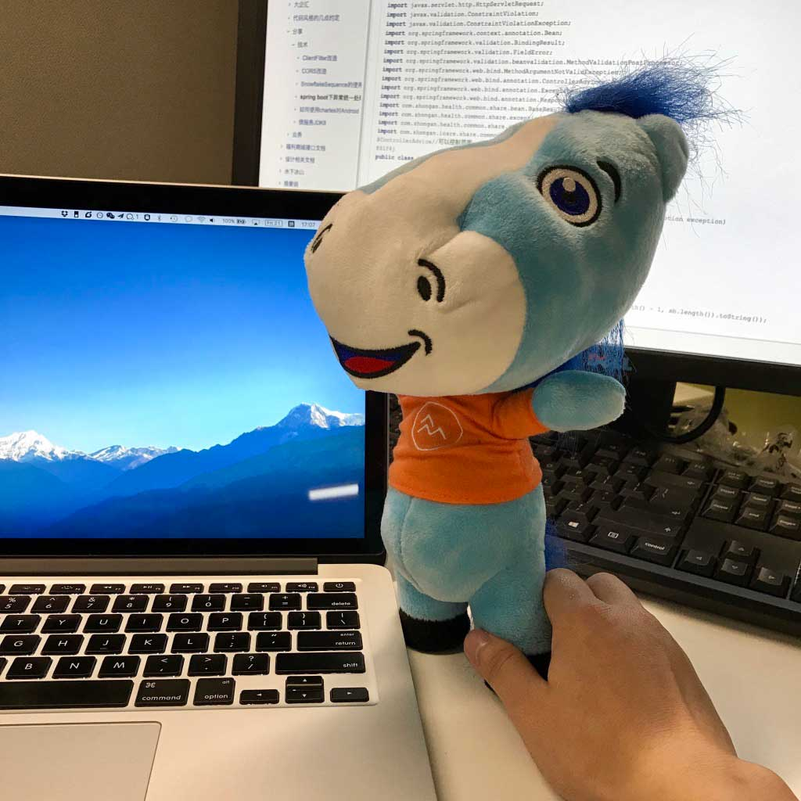

# 千橙工坊

>  千橙，一个互联网开发者，也是业余游泳和骑行爱好者.

对互联网产品有瘾，经常喜欢和大家探讨科技新闻和好玩的互联网产品; 乐于探索开源代码的精妙，并享受编程带来的成就和便捷。崇尚可读代码的编写艺术 [The Art of Readable Code](http://www.amazon.cn/%E7%BC%96%E5%86%99%E5%8F%AF%E8%AF%BB%E4%BB%A3%E7%A0%81%E7%9A%84%E8%89%BA%E6%9C%AF-%E9%B2%8D%E6%96%AF%E7%BB%B4%E5%B0%94/dp/B008B4DTG4/ref=sr_1_1?qid=1407164485&sr=8-1		"编写可读代码的艺术")。 对坏味道的代码手痒，喜欢写Troubleshooting去解决重复问题(DRY, Don't Repeat Yourself).

对于技术Growth一个比较受用的思路：尽量去看优秀源码并抽象成自己的语言去描述/输出/分享/再优化；可以在自己工作中去造一些提升效率的轮子，解决重复和繁琐的开发痛点。̨
CFA&reg; Cadidate, 关注在金融科技(信用保证保险/机构金融/消费金融/动态风控引擎等)。

坐标深圳, 看过凌晨4点的科技园. 工作之余也研究自驾游、房产、金融、小程序、机器学习等话题; 如果你也关注这些, 欢迎来撩.

- [x] 邮箱 `Z2V0LnFpYW5jaGVuZ0BnbWFpbC5jb20K`
- [ ] Linkedin <a class="LI-simple-link" href='https://cn.linkedin.com/in/iqiancheng?trk=profile-badge'>**@iqiancheng**</a>

### 职业规划
- 关注互联网金融，专注分布式应用高可用
- 成为最会写代码和懂Fintech的CFA&reg; Charterholder

### 我眼中优秀的互联网人
对技术充满热情,编程是生活的一部分. 对未知有好奇心, 拥抱变化，主动学习新技术; 对坏味道的代码过敏, 善于利用Google/Wiki或 Scholar 去解决问题并形成自己的输出成果; 有隐藏的冰山，有自己完成的项目, 有科技敏锐度，对许多不相关的技术有了解。

